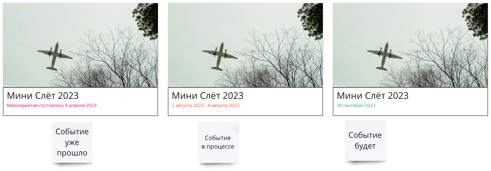
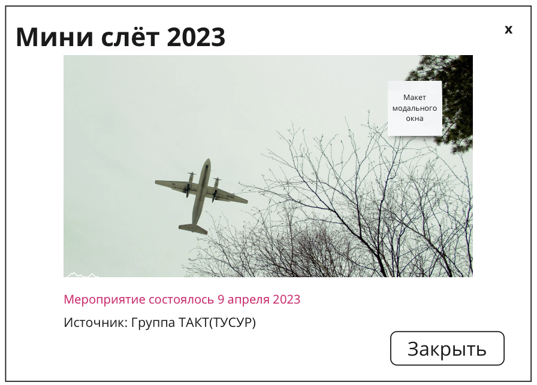

# Club events
Как пользователь, я хочу получить информацию о событиях клуба
Для того, что бы принять в них участие в качестве зрителя, участника или организатора

## Acceptance criteria

1. Компонент должен иметь два вида
   1. Малый вид:
      1. Отображается три события в строку в виде карточек с фотографией
      2. Первое событие - последнее прошедшее событие
      3. Второе и третье - будущие события, отсортированные по времени(сначала что ближе)
   2. Большой вид:
      1. Три столбца
         1. В первом столбце - прошедшие события, сначала те которые прошли недавно, потом более старые
         2. Во втором и третьем столбце события которые скоро будут, сначала те, которые ближе, потом те, которые дальше
         3. Должна быть поддержка "Lazy load" и "infinity scroll"
2. Одно событие - одна карточка
   1. Содержимое карточки:
      1. Название события
      2. Даты события
         1. У события может быть одна дата, а может быть дата начала и дата завершения
         2. В зависимости от даты события фон текста должен быть окрашен
            1. Красные - событие прошло
            2. Желтый - событие проходит сегодня
            3. Зелёный - событие будет
      3. В верхней части карточки находится фотография привязанная к событию
         1. При отсутствии фотографии - отображать предварительно загруженную фотографию(на основе времени года события)
         2. Предварительно загружаются 4 фотографии, под каждое время года
      4. При нажатии на карточку:
         1. Если указана ссылка для переадресации - выполняется переадресация
         2. Если ссылка не указана, открывается диалоговое окно, которое содержит:
            1. Всё то же, что карточка с событием
            2. Источник, откуда было загружено событие (например, ссылка на мероприятие в VK)
      
## Mockup
### Карточка события



### Модальное окно



## Technical details 

API: [Сервис takt-events ](https://github.com/takttusur/takt-events)

### Получение событий
```ts
// HTTP GET host/clubevents/api/v1/events?skip=0&take=0

class ClubEvent {
   id: number; // Идентификатор события в БД
   title: string; // Название события
   description: string; // Описание события
   sourceId: number; // Идентификатор источника, откуда получено событие
   sourceTitle: string; // Название источника, откуда получено событие
   sourceUrl: string | null; // Ссылка на источник события, обратите внимание, это не ссылка на пост или группу события, а ссылка на организаторов
   url: string | null; // Ссылка на пост или группу мероприятия, если она есть
   bannerUrl: string | null; // Ссылка на картинку для события
   startDate: DateTime; // Начало события
   endDate: DateTime | null; // Конец события, если известно
}
```