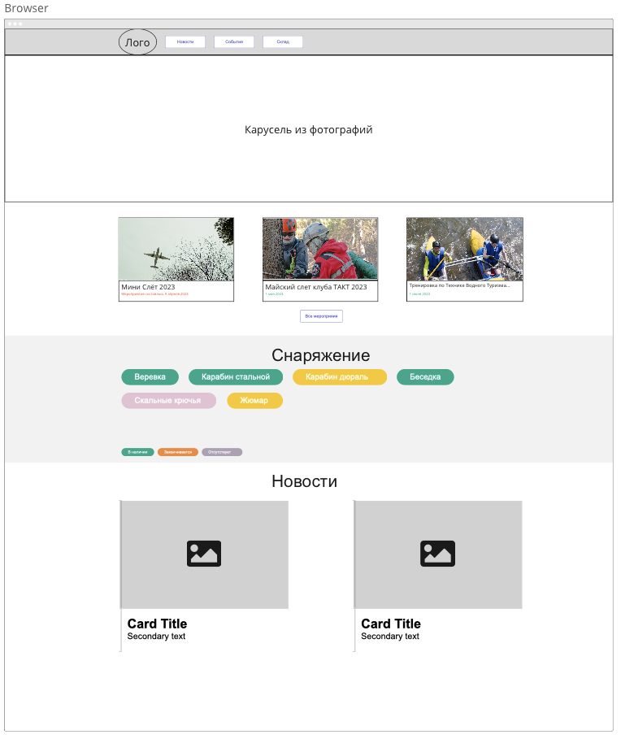

# Main page skeleton

Как разработчик компонентов я хочу иметь возможность внедрить их на главную страницу сайта
Для того, что бы пользователь сайта мог получать информацию из них

## Acceptance criteria

1. В верхней части страницы находится главное меню
   1. В левой части меню расположен логотип клуба
   2. После логотипа клуба следуют ссылки
      1. События - ведет на секцию о событиях в рамках страницы
      2. Снаряжение - ведет на секцию о снаряжении в рамках страницы
      3. Новости - ведет на секцию новостей к рамках страницы
2. Карусель фотографий должна занимать всю ширину страницы
3. После блока с каруселью фотографий должен быть размещен блок с актуальными событиями
   1. Так как данный блок еще не реализован, для него необходимо оставить место
   2. Блок занимает всю ширину страницы, но по краям должны быть отступы
4. Блок о снаряжении должен быть размещен после блока с событиями
   1. Так как блок не реализован, для него необходимо оставить место
   2. Блок занимает всю ширину страницы, но имеет отступы по краям
   3. Фон для блока должен быть темнее, чем фон страницы
5. Блок новостей располагается после блока о снаряжении
   1. Блок занимает всю ширину страницы, но по краям присутствуют отступы
   2. Необходимо предусмотреть, что блок будет использовать алгоритм "ленивой загрузки" для карточек

## Mockup

